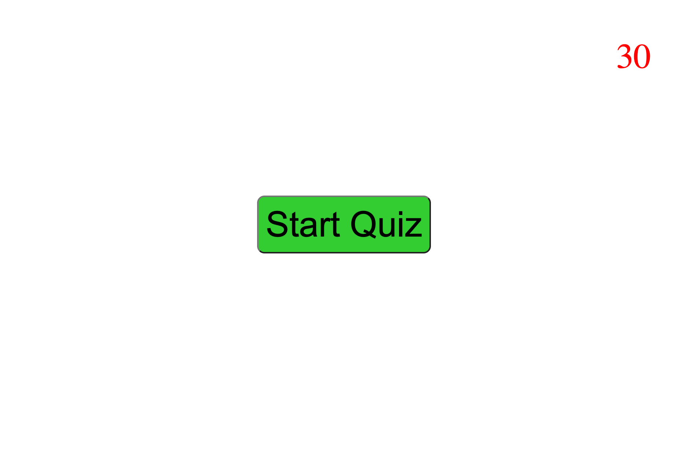

# Challenge-4-Quiz

## Website Purpose

A quiz on the subject of JavaScript, primarily powered by JavaScript itself.

## Page Built With

- HTML 5
- Basic CSS 3
- JavaScript ES6 / ES2015

## Usage

Click the green Start Quiz button to begin the 30-second timer and present the first question. Correct answers advance to the next question. Incorrect answers advance to the next question, as well as subtract 10 seconds from the timer. The more time on the timer at the end of the quiz, the better one's performance was in the quiz.

## Website URL

https://anillag.github.io/Challenge-4-Quiz/

## Contributors

Made with ❤️ by Joe Gallina (contains starter code from Trilogy Education Services)

### ©️2022 Joe Gallina
